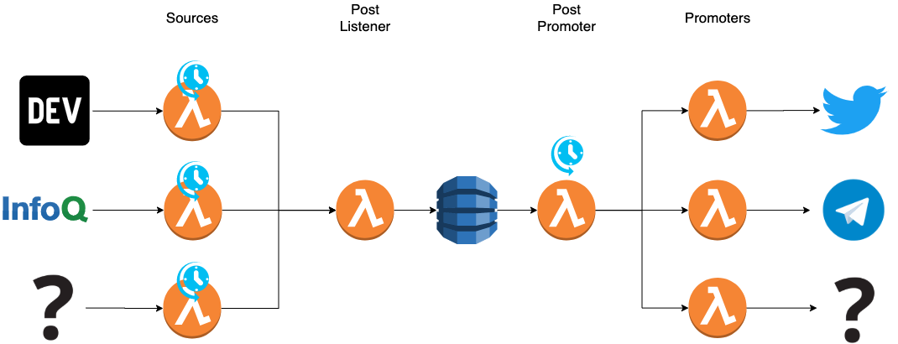

# DevsTopics

This project is the engine for [Twitter DevsTopics](https://twitter.com/DevsTopics) and [Telegram DevsTopics](https://t.me/DevsTopics) (more could be added in the near future). The main idea is to provide users with a curated list of Developer Topics with high-quality content from a diverse list of sources through the more convenient medium.

# Design

# Quickstart

Just copy `serverless.env.example.yml` as `serverless.env.yml`, put your tokens where it says **REPLACE** and run `serverles deploy`. With that you will everything running in your AWS account.
